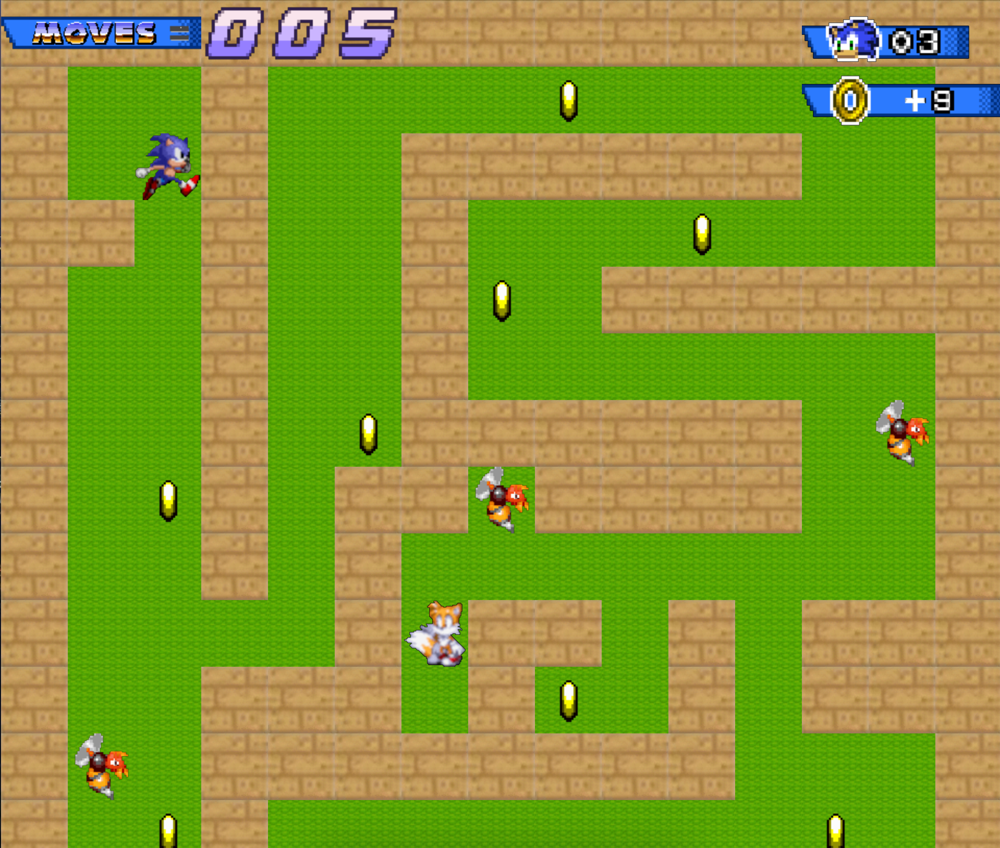

# Sonic Adventure - *so_long*

Bienvenue dans **Sonic Adventure**, une version revisitée du projet *so_long* sur le thème de Sonic. Ce jeu 2D vous plonge dans l'univers rétro de Sonic, où l'objectif est de collecter des anneaux, d'éviter des ennemis, et de s'échapper avant que le temps ne s'écoule !

## 🚀 Objectifs et apprentissages
Ce projet m'a permis de découvrir et de maîtriser plusieurs compétences techniques et créatives :
- **Programmation en C** dans le respect de la norme.
- **Utilisation de la MiniLibX**, une bibliothèque graphique pour gérer les fenêtres, les textures et les événements.
- Création et gestion de **cartes** au format `.ber`, avec validation des règles de jeu.
- Implémentation d'éléments graphiques et de **sprites animés** pour enrichir l'expérience utilisateur.
- Développement de fonctionnalités bonus, comme des ennemis mobiles et un affichage interactif du score.

## 🎮 Fonctionnalités du jeu
- **Objectif principal** : Collectez tous les anneaux et atteignez la sortie.
- **Contrôles** : Utilisez les touches `W`, `A`, `S`, `D` pour déplacer Sonic.
- **Règles** :
  - Sonic ne peut pas traverser les murs.
  - Le jeu affiche le nombre total de mouvements.
  - Des ennemis patrouillent certaines zones. Évitez-les ou vous perdez la partie !

## 🖼️ Aperçus du projet



## 🌟 Bonus ajoutés
- **Animations de sprites** : Sonic et les ennemis sont animés pour donner vie au jeu.
- **Ennemis mobiles** : Des patrouilles compliquent les déplacements.
- **Affichage intégré** : Le score total des mouvements est visible directement dans la fenêtre du jeu.
- **Thème personnalisé** : Tous les éléments visuels (décors, personnages, items) sont basés sur l'univers Sonic.

## ⚙️ Comment lancer le projet
1. Clonez ce dépôt :  
   ```bash
   git clone git@github.com:ykifadji/so_long.git
   cd sonic-adventure-so_long
2.	Compilez le projet avec le Makefile :
     ```bash
     make bonus
3.	Lancez le jeu avec une carte :
    ```bash
    ./so_long ./maps/map_bonus.ber
4.	Contrôlez Sonic avec W, A, S, D et amusez-vous !

## 🛠️ Ressources utilisées
- **MiniLibX** : Bibliothèque graphique pour gérer les textures et les événements.
- **Assets graphiques** : Sprites et décors issus de la communauté [itch.io](https://itch.io/game-assets/free/tag-sprites).
